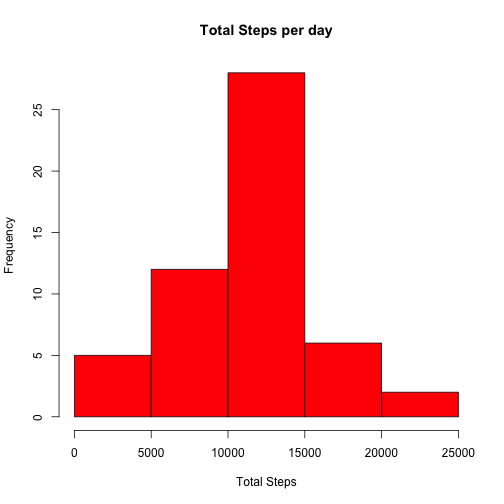
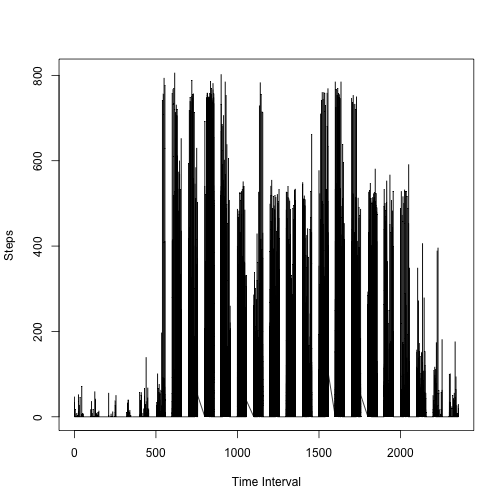
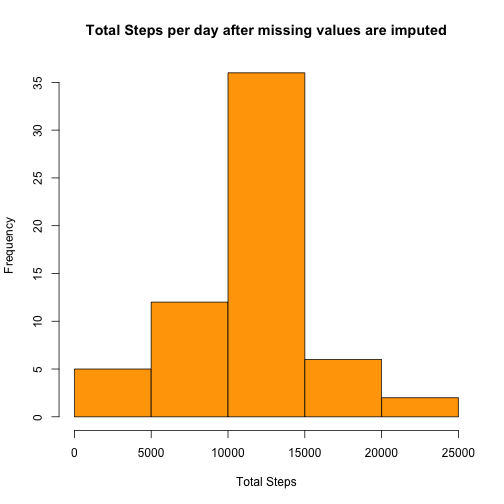
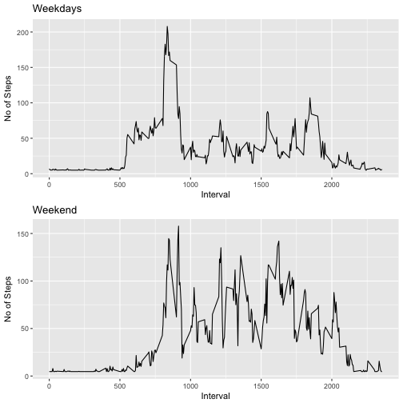

## R Markdown

This assignment makes use of data from a personal activity monitoring device. This device collects data at 5 minute intervals through out the day. The data consists of two months of data from an anonymous individual collected during the months of October and November, 2012 and include the number of steps taken in 5 minute intervals each day.


```r
download.file("https://d396qusza40orc.cloudfront.net/repdata%2Fdata%2Factivity.zip","testfile5.zip",mode = "wb")
unzip("testfile5.zip")
activity_1 <- read.csv("activity.csv", stringsAsFactors = FALSE)
activity_without_na <- na.omit(activity_1)
totstepsperday <- aggregate(activity_without_na$steps,list(activity_without_na$date),sum)


meanstepsperday <- aggregate(activity_without_na$steps,list(activity_without_na$date),mean)
names(meanstepsperday)[1]<- "Day"
names(meanstepsperday)[2]<- "Mean Steps"
medianstepsperday <- aggregate(activity_without_na$steps,list(activity_without_na$date),median)
names(medianstepsperday)[1]<- "Day"
names(medianstepsperday)[2]<- "Median Steps"
```
##Histogram of the total number of steps taken per day

```r
hist(totstepsperday$x,
     main = "Total Steps per day",col= "red", 
     xlab = "Total Steps")
```




##Mean and median of the total number of steps taken per day

```r
meanstepsperday
```

```
##           Day Mean Steps
## 1  2012-10-02  0.4375000
## 2  2012-10-03 39.4166667
## 3  2012-10-04 42.0694444
## 4  2012-10-05 46.1597222
## 5  2012-10-06 53.5416667
## 6  2012-10-07 38.2465278
## 7  2012-10-09 44.4826389
## 8  2012-10-10 34.3750000
## 9  2012-10-11 35.7777778
## 10 2012-10-12 60.3541667
## 11 2012-10-13 43.1458333
## 12 2012-10-14 52.4236111
## 13 2012-10-15 35.2048611
## 14 2012-10-16 52.3750000
## 15 2012-10-17 46.7083333
## 16 2012-10-18 34.9166667
## 17 2012-10-19 41.0729167
## 18 2012-10-20 36.0937500
## 19 2012-10-21 30.6284722
## 20 2012-10-22 46.7361111
## 21 2012-10-23 30.9652778
## 22 2012-10-24 29.0104167
## 23 2012-10-25  8.6527778
## 24 2012-10-26 23.5347222
## 25 2012-10-27 35.1354167
## 26 2012-10-28 39.7847222
## 27 2012-10-29 17.4236111
## 28 2012-10-30 34.0937500
## 29 2012-10-31 53.5208333
## 30 2012-11-02 36.8055556
## 31 2012-11-03 36.7048611
## 32 2012-11-05 36.2465278
## 33 2012-11-06 28.9375000
## 34 2012-11-07 44.7326389
## 35 2012-11-08 11.1770833
## 36 2012-11-11 43.7777778
## 37 2012-11-12 37.3784722
## 38 2012-11-13 25.4722222
## 39 2012-11-15  0.1423611
## 40 2012-11-16 18.8923611
## 41 2012-11-17 49.7881944
## 42 2012-11-18 52.4652778
## 43 2012-11-19 30.6979167
## 44 2012-11-20 15.5277778
## 45 2012-11-21 44.3993056
## 46 2012-11-22 70.9270833
## 47 2012-11-23 73.5902778
## 48 2012-11-24 50.2708333
## 49 2012-11-25 41.0902778
## 50 2012-11-26 38.7569444
## 51 2012-11-27 47.3819444
## 52 2012-11-28 35.3576389
## 53 2012-11-29 24.4687500
```

```r
medianstepsperday
```

```
##           Day Median Steps
## 1  2012-10-02            0
## 2  2012-10-03            0
## 3  2012-10-04            0
## 4  2012-10-05            0
## 5  2012-10-06            0
## 6  2012-10-07            0
## 7  2012-10-09            0
## 8  2012-10-10            0
## 9  2012-10-11            0
## 10 2012-10-12            0
## 11 2012-10-13            0
## 12 2012-10-14            0
## 13 2012-10-15            0
## 14 2012-10-16            0
## 15 2012-10-17            0
## 16 2012-10-18            0
## 17 2012-10-19            0
## 18 2012-10-20            0
## 19 2012-10-21            0
## 20 2012-10-22            0
## 21 2012-10-23            0
## 22 2012-10-24            0
## 23 2012-10-25            0
## 24 2012-10-26            0
## 25 2012-10-27            0
## 26 2012-10-28            0
## 27 2012-10-29            0
## 28 2012-10-30            0
## 29 2012-10-31            0
## 30 2012-11-02            0
## 31 2012-11-03            0
## 32 2012-11-05            0
## 33 2012-11-06            0
## 34 2012-11-07            0
## 35 2012-11-08            0
## 36 2012-11-11            0
## 37 2012-11-12            0
## 38 2012-11-13            0
## 39 2012-11-15            0
## 40 2012-11-16            0
## 41 2012-11-17            0
## 42 2012-11-18            0
## 43 2012-11-19            0
## 44 2012-11-20            0
## 45 2012-11-21            0
## 46 2012-11-22            0
## 47 2012-11-23            0
## 48 2012-11-24            0
## 49 2012-11-25            0
## 50 2012-11-26            0
## 51 2012-11-27            0
## 52 2012-11-28            0
## 53 2012-11-29            0
```

##Time series plot of the average number of steps taken is below

```r
averagestepsperdayinterval <- aggregate(activity_without_na$steps,list(activity_without_na$date,activity_without_na$interval),mean)
plot(averagestepsperdayinterval$Group.2,averagestepsperdayinterval$x,type = "l" , xlab = "Time Interval" , ylab = "Steps")
```



```r
maxstepsperinterval <- aggregate(activity_without_na$steps,list(activity_without_na$interval),max)
intervalnos <- maxstepsperinterval[which.max(maxstepsperinterval$x),]
```

##The 5-minute interval, on average across all the days in the dataset which contains the maximum number of steps is ``615``

## Code to describe and show a strategy for imputing missing data


```r
activity_with_na <- subset(activity_1, is.na(activity_1$steps))
#NROW(activity_with_na)
meansteps <- mean(activity_without_na$steps)
activity_with_na$steps <- meansteps
activity_rep_na <- rbind(activity_without_na,activity_with_na)
totstepsperdaymod <- aggregate(activity_rep_na$steps,list(activity_rep_na$date),sum)
meanstepsperdaymod <- aggregate(activity_rep_na$steps,list(activity_rep_na$date),mean)
medianstepsperdaymod <- aggregate(activity_rep_na$steps,list(activity_rep_na$date),median)

names(meanstepsperdaymod)[1]<- "Day"
names(meanstepsperdaymod)[2]<- "Mean Steps"
names(medianstepsperdaymod)[1]<- "Day"
names(medianstepsperdaymod)[2]<- "Median Steps"
```

##The total number of missing values in the dataset is ``2304``


##Histogram of the total number of steps taken each day after missing values are imputed

```r
hist(totstepsperdaymod$x,
     main = "Total Steps per day after missing values are imputed",col= "orange", 
     xlab = "Total Steps")
```




##Mean and median of the total number of steps taken per day incuding missing data

```r
meanstepsperdaymod
```

```
##           Day Mean Steps
## 1  2012-10-01 37.3825996
## 2  2012-10-02  0.4375000
## 3  2012-10-03 39.4166667
## 4  2012-10-04 42.0694444
## 5  2012-10-05 46.1597222
## 6  2012-10-06 53.5416667
## 7  2012-10-07 38.2465278
## 8  2012-10-08 37.3825996
## 9  2012-10-09 44.4826389
## 10 2012-10-10 34.3750000
## 11 2012-10-11 35.7777778
## 12 2012-10-12 60.3541667
## 13 2012-10-13 43.1458333
## 14 2012-10-14 52.4236111
## 15 2012-10-15 35.2048611
## 16 2012-10-16 52.3750000
## 17 2012-10-17 46.7083333
## 18 2012-10-18 34.9166667
## 19 2012-10-19 41.0729167
## 20 2012-10-20 36.0937500
## 21 2012-10-21 30.6284722
## 22 2012-10-22 46.7361111
## 23 2012-10-23 30.9652778
## 24 2012-10-24 29.0104167
## 25 2012-10-25  8.6527778
## 26 2012-10-26 23.5347222
## 27 2012-10-27 35.1354167
## 28 2012-10-28 39.7847222
## 29 2012-10-29 17.4236111
## 30 2012-10-30 34.0937500
## 31 2012-10-31 53.5208333
## 32 2012-11-01 37.3825996
## 33 2012-11-02 36.8055556
## 34 2012-11-03 36.7048611
## 35 2012-11-04 37.3825996
## 36 2012-11-05 36.2465278
## 37 2012-11-06 28.9375000
## 38 2012-11-07 44.7326389
## 39 2012-11-08 11.1770833
## 40 2012-11-09 37.3825996
## 41 2012-11-10 37.3825996
## 42 2012-11-11 43.7777778
## 43 2012-11-12 37.3784722
## 44 2012-11-13 25.4722222
## 45 2012-11-14 37.3825996
## 46 2012-11-15  0.1423611
## 47 2012-11-16 18.8923611
## 48 2012-11-17 49.7881944
## 49 2012-11-18 52.4652778
## 50 2012-11-19 30.6979167
## 51 2012-11-20 15.5277778
## 52 2012-11-21 44.3993056
## 53 2012-11-22 70.9270833
## 54 2012-11-23 73.5902778
## 55 2012-11-24 50.2708333
## 56 2012-11-25 41.0902778
## 57 2012-11-26 38.7569444
## 58 2012-11-27 47.3819444
## 59 2012-11-28 35.3576389
## 60 2012-11-29 24.4687500
## 61 2012-11-30 37.3825996
```

```r
medianstepsperdaymod
```

```
##           Day Median Steps
## 1  2012-10-01      37.3826
## 2  2012-10-02       0.0000
## 3  2012-10-03       0.0000
## 4  2012-10-04       0.0000
## 5  2012-10-05       0.0000
## 6  2012-10-06       0.0000
## 7  2012-10-07       0.0000
## 8  2012-10-08      37.3826
## 9  2012-10-09       0.0000
## 10 2012-10-10       0.0000
## 11 2012-10-11       0.0000
## 12 2012-10-12       0.0000
## 13 2012-10-13       0.0000
## 14 2012-10-14       0.0000
## 15 2012-10-15       0.0000
## 16 2012-10-16       0.0000
## 17 2012-10-17       0.0000
## 18 2012-10-18       0.0000
## 19 2012-10-19       0.0000
## 20 2012-10-20       0.0000
## 21 2012-10-21       0.0000
## 22 2012-10-22       0.0000
## 23 2012-10-23       0.0000
## 24 2012-10-24       0.0000
## 25 2012-10-25       0.0000
## 26 2012-10-26       0.0000
## 27 2012-10-27       0.0000
## 28 2012-10-28       0.0000
## 29 2012-10-29       0.0000
## 30 2012-10-30       0.0000
## 31 2012-10-31       0.0000
## 32 2012-11-01      37.3826
## 33 2012-11-02       0.0000
## 34 2012-11-03       0.0000
## 35 2012-11-04      37.3826
## 36 2012-11-05       0.0000
## 37 2012-11-06       0.0000
## 38 2012-11-07       0.0000
## 39 2012-11-08       0.0000
## 40 2012-11-09      37.3826
## 41 2012-11-10      37.3826
## 42 2012-11-11       0.0000
## 43 2012-11-12       0.0000
## 44 2012-11-13       0.0000
## 45 2012-11-14      37.3826
## 46 2012-11-15       0.0000
## 47 2012-11-16       0.0000
## 48 2012-11-17       0.0000
## 49 2012-11-18       0.0000
## 50 2012-11-19       0.0000
## 51 2012-11-20       0.0000
## 52 2012-11-21       0.0000
## 53 2012-11-22       0.0000
## 54 2012-11-23       0.0000
## 55 2012-11-24       0.0000
## 56 2012-11-25       0.0000
## 57 2012-11-26       0.0000
## 58 2012-11-27       0.0000
## 59 2012-11-28       0.0000
## 60 2012-11-29       0.0000
## 61 2012-11-30      37.3826
```

##Activity patterns between weekdays and weekends


```r
#install.packages("anytime")
library(anytime)
activity_rep_na_mod <- activity_rep_na
activity_rep_na_mod$date=anydate(activity_rep_na_mod$date)
weekday_col <- weekdays(activity_rep_na_mod$date)
activity_rep_na_mod_week <- cbind(activity_rep_na_mod,weekday_col)
levels(activity_rep_na_mod_week$weekday_col)[levels(activity_rep_na_mod_week$weekday_col)=="Monday" ] <- "weekday"
levels(activity_rep_na_mod_week$weekday_col)[levels(activity_rep_na_mod_week$weekday_col)=="Tuesday" ] <- "weekday"
levels(activity_rep_na_mod_week$weekday_col)[levels(activity_rep_na_mod_week$weekday_col)=="Wednesday" ] <- "weekday"
levels(activity_rep_na_mod_week$weekday_col)[levels(activity_rep_na_mod_week$weekday_col)=="Thursday" ] <- "weekday"
levels(activity_rep_na_mod_week$weekday_col)[levels(activity_rep_na_mod_week$weekday_col)=="Friday" ] <- "weekday"
levels(activity_rep_na_mod_week$weekday_col)[levels(activity_rep_na_mod_week$weekday_col)=="Saturday" ] <- "weekend"
levels(activity_rep_na_mod_week$weekday_col)[levels(activity_rep_na_mod_week$weekday_col)=="Sunday" ] <- "weekend"

activity_rep_na_mod_weekday <- subset(activity_rep_na_mod_week,activity_rep_na_mod_week$weekday_col=="weekday")
activity_rep_na_mod_weekend <- subset(activity_rep_na_mod_week,activity_rep_na_mod_week$weekday_col=="weekend")

averagestepsperweekday <- aggregate(activity_rep_na_mod_weekday$steps,list(activity_rep_na_mod_weekday$interval),mean)
names(averagestepsperweekday)[1]<- "Time Interval"
names(averagestepsperweekday)[2]<-  "Steps"


averagestepsperweekend <- aggregate(activity_rep_na_mod_weekend$steps,list(activity_rep_na_mod_weekend$interval),mean)
names(averagestepsperweekend)[1]<- "Time Interval"
names(averagestepsperweekend)[2]<-  "Steps"


library(ggplot2)
library(grid)
library(gridExtra)
```

##Panel plot comparing the average number of steps taken per 5-minute interval across weekdays and weekends.


```r
plot1 <- ggplot(averagestepsperweekday, aes(x=averagestepsperweekday$`Time Interval`, y=averagestepsperweekday$Steps))+
  geom_line()+
  labs(x="Interval", y="No of Steps" ,title ="Weekdays")


plot2 <- ggplot(averagestepsperweekend, aes(x=averagestepsperweekend$`Time Interval`, y=averagestepsperweekend$Steps))+
  geom_line()+
  labs(x="Interval", y="No of Steps" , title = "Weekend")
 
grid.arrange(plot1, plot2, ncol =1)
```


